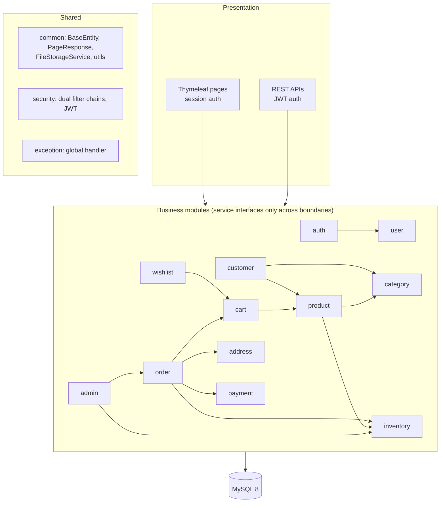
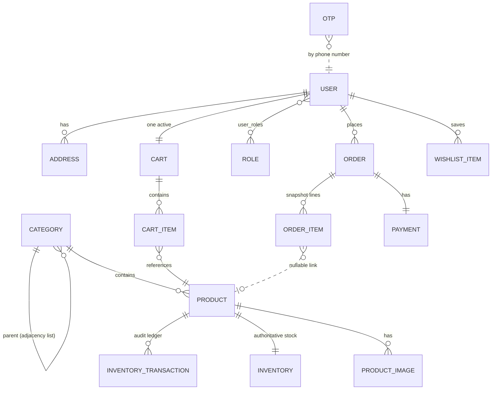
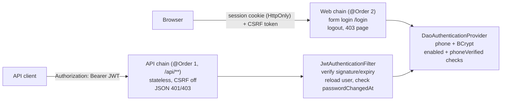
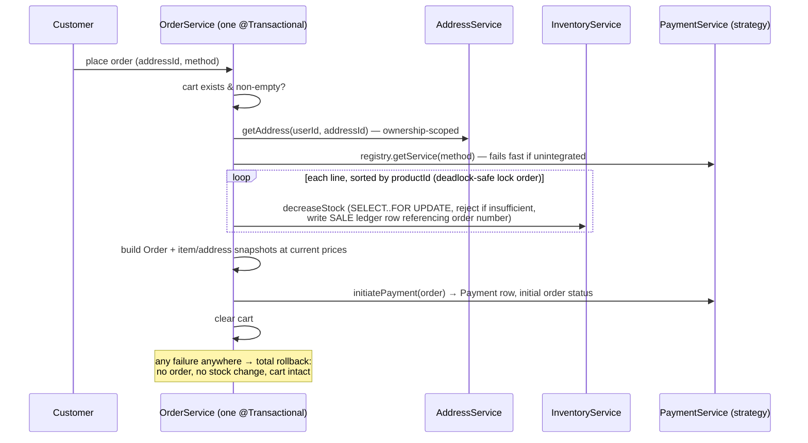

# System Design — Store Management System

This document explains how the system was designed **before and while** it was built: how the requirements were analyzed, why each architectural decision was made, and why the project was built in the order it was. It is the "how to think about this project" companion to the README (which explains how to run it).

---

## 1. Starting point: analyzing the requirements

The brief: a production-style e-commerce + inventory system for a **small general store** (groceries, clothing, household, personal care), with a customer storefront and an admin back office, built by one small team.

Reading that carefully yields the constraints that drive everything else:

| Observation | Design consequence |
|---|---|
| Small store, one team, one database | A single deployable — microservices would add network failure modes, distributed transactions, and ops burden with zero benefit at this scale |
| But the domain has ~15 clear capabilities (catalog, cart, orders, inventory…) | The *code* still needs hard internal boundaries, or the monolith rots into a ball of mud |
| Real money and real stock | Correctness beats cleverness: transactions, locking, and audit trails are non-negotiable |
| Server-rendered pages **and** JSON APIs | Two client types with different security needs — must be designed for from day one |
| Phone-first customers (OTP login) | The phone number, not email, is the identity anchor |
| Integrations (SMS, payments, file storage) will change later | Every external touchpoint goes behind an interface from the start |

The conclusion: a **modular monolith** — one Spring Boot application, one MySQL database, but feature-based modules with disciplined boundaries.

## 2. Why a modular monolith (and not microservices)

The decision rule: *choose the simplest architecture that keeps future options open.*

- **One transaction boundary.** Checkout must atomically reduce stock, create an order, record a payment, and clear the cart. In a monolith that is one `@Transactional` method; across services it becomes sagas and compensation logic — enormous complexity for a general store.
- **One thing to deploy, monitor, and back up.** A small team can actually operate this.
- **Boundaries preserved anyway.** Each module owns its entities, repositories, services, DTOs, and controllers. Modules talk **only through service interfaces**, never each other's repositories. If one capability ever needs to scale independently, its module is already shaped like a service.



**Dependency rules** (enforced by convention and review):
1. Controllers never contain business logic; services never render views.
2. A module may call another module's **service interface** and reference its **entities** in JPA relationships — never its repositories or impl classes.
3. `common`, `security`, `config`, `exception` are foundation packages: anyone may depend on them; they depend on no business module.
4. JPA entities never cross an API boundary — every controller speaks DTOs.

## 3. Data model — designed around three "truths"

The schema falls out of asking: *what must never be wrong?*



**Truth 1 — Stock.** `Inventory.currentStock` is the single source of truth, changed only through one locked write path that also writes an immutable `InventoryTransaction` (type, quantity, `previousStock → newStock`, reference). The ledger is *gapless by construction*, so it doubles as a verifiable audit trail. `Product.stockQuantity` is a denormalized read copy for storefront queries, updated in the same transaction.

**Truth 2 — Order history.** Orders must stay true even when the catalog changes. So `OrderItem` snapshots `productName`, `sku`, `priceAtPurchase` (nullable product FK — history outlives deletion), and the shipping address is an `@Embeddable` copy. Nothing about a past order can be rewritten by editing a product or address.

**Truth 3 — Identity.** Phone number is the login key: unique, OTP-verified, and not self-editable (changing it would require re-verification). Email is unique too. Roles are a many-to-many whitelist that **no customer-facing DTO can touch** — role escalation is prevented by the absence of a field, not by a check someone could forget.

Integrity is pushed into the database wherever possible: unique constraints (email, phone, slugs, SKU, order number, one cart per user, one product per cart/wishlist pair, one payment per order) and indexes on hot lookups (OTP phone+purpose, ledger by product, orders/addresses by user).

## 4. Security architecture — two clients, two chains

The web app and the API have opposite needs, so there are **two Spring Security filter chains** sharing one `DaoAuthenticationProvider` (phone + BCrypt + account-status checks — the rules can't drift apart):



Reasoning behind the split: a JWT stored where browser JavaScript can read it is an XSS liability, while an HttpOnly session cookie is not — so pages use sessions; APIs, which need statelessness, use JWTs. Key JWT decisions: the user is **re-loaded from the DB per request** (disabling an account takes effect immediately), and every token carries `iat` compared against `passwordChangedAt` (a password change/reset **revokes all outstanding tokens**).

Layered on top:
- **Authorization**: route rules (`/admin/**` → ADMIN, `/customer/**` → CUSTOMER) with secure-by-default `anyRequest().authenticated()`.
- **Ownership**: every customer query is scoped `findByIdAndUserId(...)` with the ID taken from the security principal only — another user's data is a 404 (unreachable, and no ID probing), not a 403 after a forgettable check.
- **Secrets at rest**: passwords, OTP codes, and reset tokens are all BCrypt-hashed; plain values exist only in transit.
- **OTP abuse controls**: 5-minute expiry, single use, persisted attempt counter (deliberately outside the transaction so failed attempts can't be rolled back), resend cooldown, hourly cap.
- **Uploads**: content-type whitelist, size cap, UUID filenames, path-traversal-safe resolution.

## 5. The critical flow: checkout

Checkout is where money, stock, and state meet — it was designed first on paper because everything else (cart rules, inventory locking, snapshots) had to support it.



Concurrency reasoning: stock rows are hot counters with must-not-oversell semantics, so **pessimistic locking** was chosen over optimistic `@Version` — under contention (two buyers, last unit) optimistic locking fails and retries exactly when correctness matters; a millisecond row lock serializes instead. Multi-line orders lock in ascending product-ID order so concurrent checkouts can never deadlock. The order lifecycle after checkout is an explicit whitelist state machine (`PENDING → CONFIRMED → PROCESSING → PACKED → SHIPPED → DELIVERED`, cancellation until packing, terminal states final) — transitions not in the map don't exist.

## 6. Extension points — interfaces where change is expected

Every integration that *will* change was abstracted on day one, each following the same pattern (interface + one working implementation + config-based selection):

| Abstraction | Today | Later, by adding one class |
|---|---|---|
| `OtpService` (template method: `deliverOtp`) | Console log | `TwilioOtpService` |
| `FileStorageService` | Local disk | `S3FileStorageService` |
| `PaymentService` (strategy registry by method) | `CodPaymentService` | `RazorpayPaymentService` — checkout, cancellation refunds, and the "initial order status" rule all route through it automatically |

The registry pattern for payments has a deliberate honesty property: a method with no implementation (ONLINE, today) is **rejected at checkout** rather than producing an unpayable order.

## 7. Build order — why the phases were sequenced this way

The project was built in 18 phases, ordered by a simple rule: **each phase ships something verifiable that the next phase stands on.**

```
1  Scaffold + profiles + auditing        (compiles, runs, /health)
2  Users & roles                          (identity exists)
3  Registration                           (identity is creatable)
4  OTP verification                       (identity is trustworthy)
5  Login + dual security chains           (identity is usable) ← security BEFORE features
6  Forgot password                        (identity is recoverable)
7  Categories → 8 Products → 9 Storefront (catalog: structure → items → shopping window)
10 Inventory (locking + ledger)           ← BEFORE cart/checkout, which depend on its guarantees
11 Cart → 12 Wishlist & addresses         (buying intent + delivery data)
13 Checkout & orders                      (the transaction everything prepared for)
14 Payment architecture                   (extracted once a real flow existed to shape it)
15 Admin dashboard → 16 Profile → 17 Admin orders (operate the store)
18 Security review, OpenAPI, tests, docs  (consolidate, never expand)
```

Two sequencing decisions worth calling out: **security came before features** (phase 5), so every later page/API was born inside the right chain instead of being retrofitted; and **inventory came before cart/checkout**, so the selling flows could be written against locking and audit guarantees that already existed and were already tested.

Working agreements held across all phases: explain before coding, constructor injection only, no business logic in controllers, DTOs everywhere, no TODO/stub code, and the build must be green before a phase ends.

## 8. Testing strategy

Tests target **invariants, not lines**: the things that must never be wrong. All suites run on an in-memory H2 (`test` profile) so `mvn test` needs no external services, and they exercise the real Spring context — real transactions, real security filters, real Thymeleaf rendering.

- **Money/stock invariants**: negative stock impossible; ledger chain gapless; oversell rolls back the *entire* checkout; totals math (subtotal − discount = total) asserted numerically.
- **Security invariants**: cross-user access is 404 in every module; unverified phones can't log in; tampered JWTs rejected; role and phone immutable through profile paths; admin pages 403 for customers.
- **State machine**: legal chains pass (COD collected on delivery), skips/reversals/terminal moves rejected without side effects.
- **Awkward-to-test paths made testable by design**: OTP codes are stored hashed, so a `@TestConfiguration` capturing delivery hook exercises the genuine verify path — the abstraction added for Twilio made the security test possible.

A note from practice: the phase-9 page-rendering tests immediately caught a real template bug that had shipped in phase 3 (`#fields.hasGlobalErrors(...)` misuse outside form scope) — the strongest argument for rendering pages in tests rather than assuming templates work.

## 9. Known trade-offs (accepted deliberately)

- `ddl-auto: update` in dev / `validate` in prod instead of Flyway migrations — fine for a single-team project; migrations are the first thing to add before multi-environment releases.
- "Popular products" is a stock-based placeholder until order volume exists to rank by sales.
- Content-type upload validation trusts the client's MIME type; magic-byte sniffing is listed as a future hardening step.
- The `notification` module is an empty documented package rather than a stubbed implementation — honest absence over fake code.
