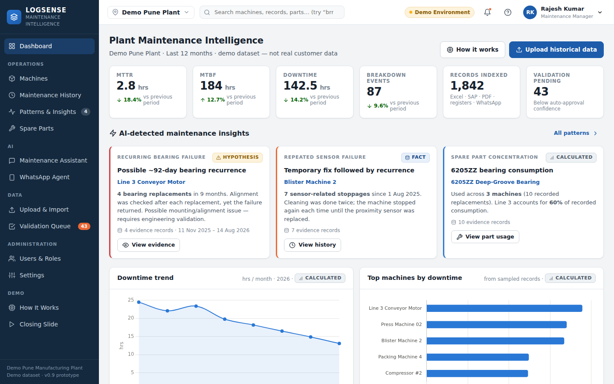
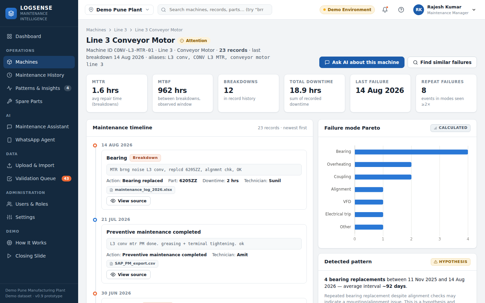
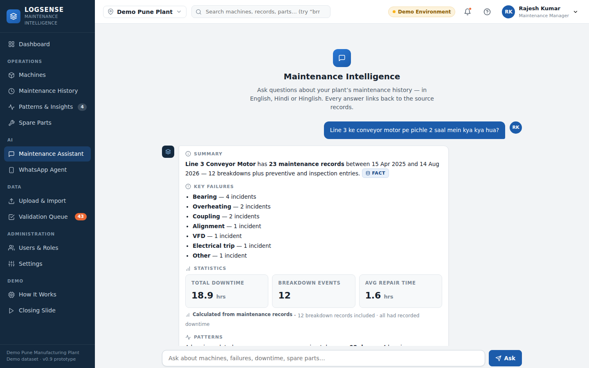
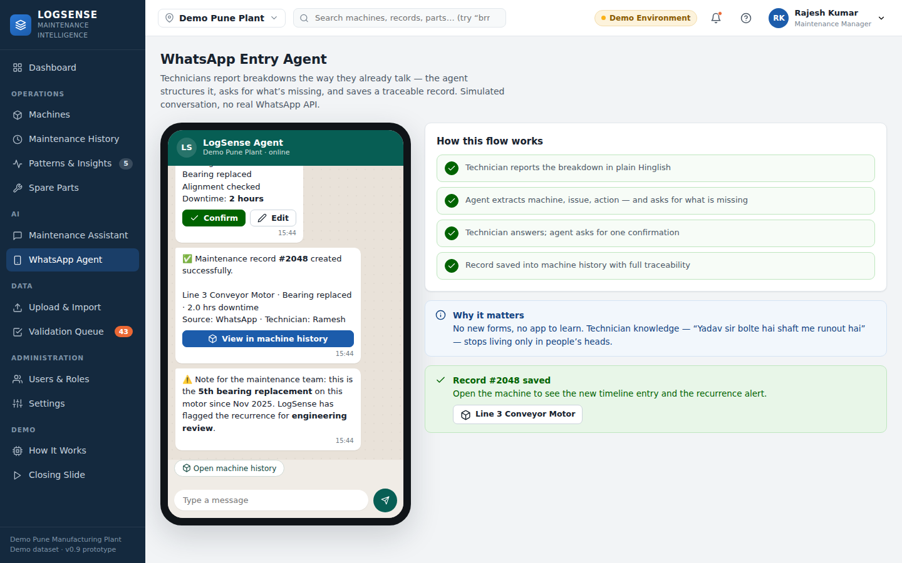
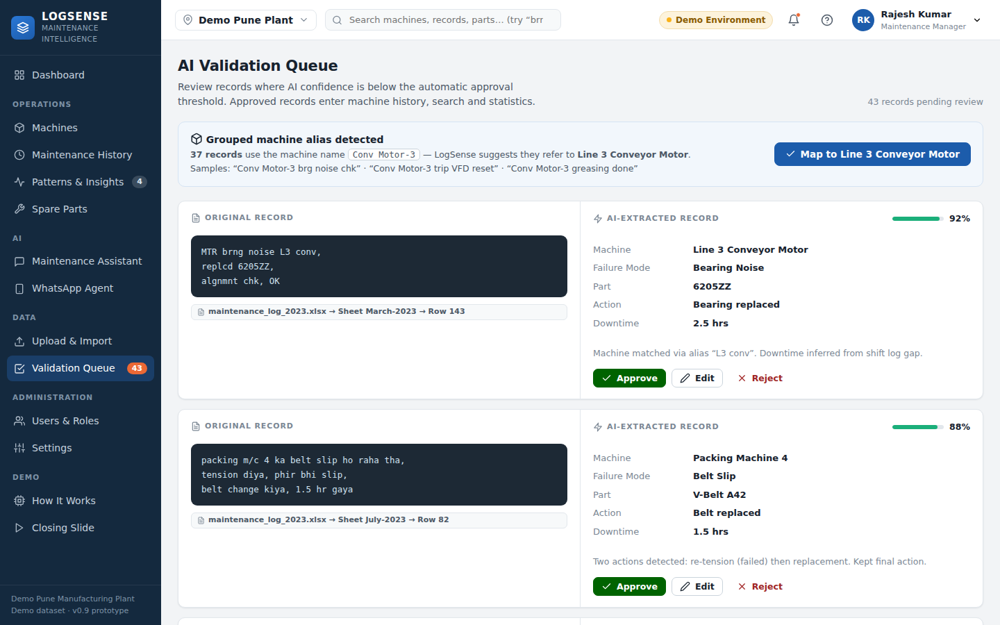
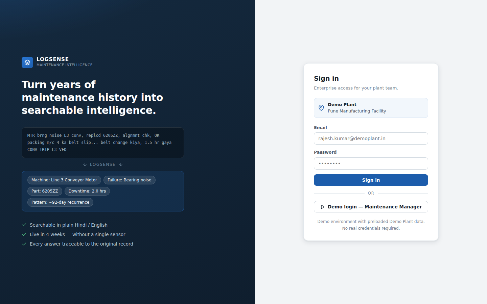

# LogSense Maintenance Intelligence — Client Demo Prototype

> “Your plant’s entire breakdown history, searchable in plain Hindi/English,
> in 4 weeks, without a single sensor.”

A **frontend-only, interactive prototype** of LogSense for client demonstrations.
Built with **HTML5 + CSS3 + vanilla JavaScript** (Chart.js from a CDN for charts).
No backend, no build step, no real AI/WhatsApp/OCR integrations — everything is
convincingly **simulated with a single, internally consistent mock dataset**.

## Running it

Open `index.html` in any modern browser — that’s it. No server or build required.

- Charts load Chart.js from cdnjs, so an internet connection is needed for the
  charts (everything else works offline; charts degrade to a friendly notice).
- If your browser restricts `file://` pages, serve the folder instead:
  `python3 -m http.server 8000` → http://localhost:8000

Click **“Demo login”** on the login screen to enter as *Rajesh Kumar,
Maintenance Manager* of the **Demo Pune Manufacturing Plant**.

## Screenshots

| | |
|---|---|
|  |  |
| *Plant dashboard — KPIs, charts, AI-detected insights* | *Machine detail — stats, Pareto, raw-log timeline* |
|  |  |
| *AI assistant — structured, cited, badge-labelled answers* | *WhatsApp agent — Hinglish report → record #2048* |
|  |  |
| *Validation queue — alias bulk-mapping + split-screen review* | *Login — the before/after story* |

## The 9-minute demo journey

The whole UI is built around one clickable story (also available in-app:
**Help icon → Demo script**):

| Time | Step | Where |
|------|------|-------|
| 0:00 | KPIs, charts, AI-detected insights | Dashboard |
| 1:00 | Import `maintenance_log_2023.xlsx` → animated 8-step pipeline → 1,842 records | Upload & Import |
| 2:00 | Bulk-map the “Conv Motor-3” alias (37 records), approve/reject individual records | Validation Queue |
| 3:00 | 23 records, failure Pareto, timeline, **View Source** drawer | Machines → Line 3 Conveyor Motor |
| 4:00 | “Line 3 ke conveyor motor pe pichle 2 saal mein kya kya hua?” → structured answer, clickable citations | Maintenance Assistant |
| 5:00 | ~92-day bearing recurrence, labelled **HYPOTHESIS** | (same answer / Patterns & Insights) |
| 6:00 | “Total downtime bearing failures Line 3 last 2 years” → 18.7 hrs, 7/7 records, **CALCULATED** | Maintenance Assistant |
| 6:45 | “6205 bearing kahan kahan lagi hai?” → 3 machines, Line 3 concentration | Maintenance Assistant / Spare Parts |
| 7:30 | Technician reports breakdown in Hinglish, agent clarifies downtime, Confirm → record #2048 | WhatsApp Agent |
| 9:00 | New timeline entry + **5th bearing replacement** recurrence alert | Line 3 Conveyor Motor |
| 9:30 | “Your Plant’s Memory, Searchable.” | Closing Slide (sidebar → Demo) |

**Reset Demo** (user menu or Settings) restores the pre-demo state.

## Product principles the prototype enforces

- **FACT / CALCULATED / HYPOTHESIS badges** — AI output is always labelled;
  hypotheses are never shown as confirmed root causes.
- **Deterministic numbers** — every statistic in chat answers, dashboards,
  parts and patterns is computed from `js/mock-data.js`; same question →
  same answer. If a chat answer says 23 records, the timeline has 23 records.
- **Traceability** — every record, citation and insight opens a source drawer
  with the original raw text, file, sheet and row.
- **Human validation** — low-confidence extractions sit in a review queue
  before they join the index.
- **Demo honesty** — the header shows a “Demo Environment” pill; nothing is
  presented as real customer data, and no real SQL/LLM execution is claimed.

## Structure

```
logsense-demo/
├── index.html          # app shell: login, sidebar, topbar, overlays
├── css/
│   ├── style.css       # tokens, layout, login, buttons
│   ├── components.css  # cards, tables, timeline, chat, phone, wizard…
│   └── responsive.css  # tablet & phone rules
└── js/
    ├── mock-data.js    # THE single source of demo data + derived stats
    ├── app.js          # icons, state, router, drawer/modal/toasts, search
    ├── dashboard.js    # KPIs, charts, AI insights
    ├── machines.js     # machine master, machine detail, history table
    ├── assistant.js    # rule-based deterministic AI chat
    ├── upload.js       # drag & drop + simulated ingestion pipeline
    ├── validation.js   # split-screen review + alias bulk-mapping
    ├── patterns.js     # failure patterns + spare parts intelligence
    ├── admin.js        # users & roles, settings, how-it-works, closing
    └── whatsapp.js     # phone-style technician entry simulation
```

Demo state (login, alias mapped, record #2048 added, approvals) lives in
`sessionStorage`, so the story survives a page refresh within the session.

## Hinglish / shorthand search

The search layer expands technician shorthand before matching, so
`brng`, `BRG`, `bearng`, `bearing gaya` and `motor bearing sound` all resolve
to bearing-related records, with a “Why this result matched” explanation.
Try it in the global search bar, Maintenance History, or the assistant.
Press **`/`** anywhere in the app to jump to global search, which returns
machines, maintenance records, spare parts **and AI insights**.

---

*Prototype for client demonstration only. All data is fictitious Demo Plant data.*
